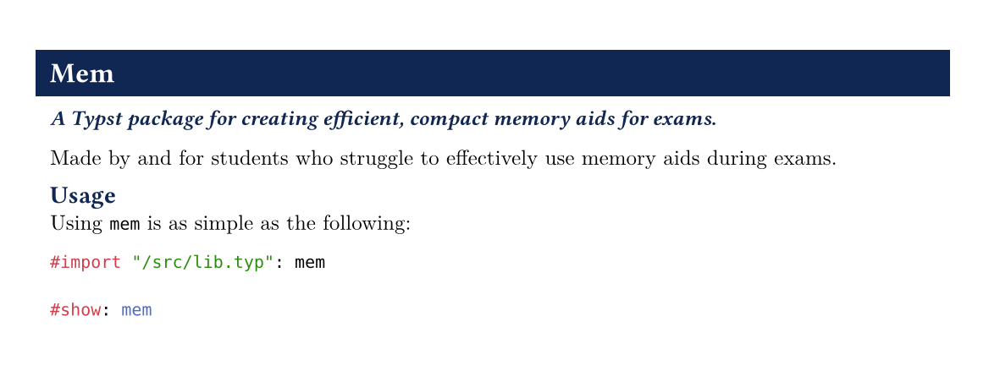

# mem

A compact and tested Typst template for creating memory sheets for exams.



## About this package

As of creating this repository, I am in my final semester of a double Bachelor's degree
in Mathematics and Computer Science. Over the past few years, I developed a simple $\LaTeX$
template for a memory aid that I would use in all of my exams.

As someone with ADHD and a learning disability, I struggled to focus on my exam _and_ on looking 
up materials on my sheets. I would fail to find things I had just looked at, I would misread or
misidentify information, and overall, I am a rather slow reader.

My template allowed me to plainly section information, colourise mathematics for both inline and
block-level content, and to freely adjust styling for the rare case where things just wouldn't
gel together nicely. All-in-all, my $\LaTeX$ template was a hacked-together beast that helped me
out _massively_.

Now, with Typst, it is so much easier. Since it is significantly easier to read source materials,
I decided it was time to share what I found works for me. I have put in several years of testing 
and refining this template style (technically, this is a package and not a template... yet?).
While I mainly have experience with my old $\LaTeX$ version, I hope this remade Typst equivalent
is able to help someone out there, too.

If you use this template for your exams, here is a bonus tip for you: print in colour and laminate
your sheet! It might be a little extra and over-the-top, but it has saved me **many** times.

## Usage

```typ
// I will update this when I eventually publish this package
#import "/src/lib.typ": mem // see also: palette, student-info

#show: mem

= Section
== Subsection
=== In-lined subsubsection

:)
```

## Example

See [examples/fourier_analysis.typ](./examples/fourier_analysis.typ) for a complete example.

<image src="./examples/fourier_analysis_1.png" width="600"/>
<image src="./examples/fourier_analysis_2.png" width="600"/>
